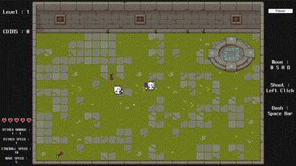
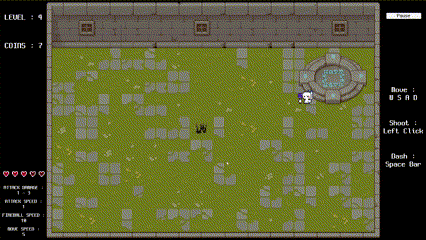

# Hall of Flame

Source Code of Hall of Flame with Unity. The game was made in 4 days in April, 2023.

  

## Highlights

### Map Generation

Map generation is handled by the [BoardManager](Assets/Scripts/GameManager/BoardManager.cs). 
In each level, the system randomly generates the following elements:

- **Tiles**: forming the base ground of the map.
- **Enemies**: placed at random valid positions.
- **Spikes (Hazards)**: scattered throughout the map. 

  
   
  <em>Map Generation</em>

### Enemies

  
  
   
  <em>Archer Base Unit</em> &nbsp;&nbsp;&nbsp;&nbsp;&nbsp;&nbsp;&nbsp;&nbsp;&nbsp;&nbsp;&nbsp;&nbsp;&nbsp;&nbsp;&nbsp;&nbsp;&nbsp;&nbsp;&nbsp;&nbsp;&nbsp;&nbsp;&nbsp;&nbsp;&nbsp;&nbsp;&nbsp;&nbsp;&nbsp;&nbsp;&nbsp;&nbsp;&nbsp;&nbsp;&nbsp;&nbsp;&nbsp;&nbsp;&nbsp;&nbsp;&nbsp;&nbsp;&nbsp;&nbsp;&nbsp;&nbsp;&nbsp;&nbsp;&nbsp;&nbsp;&nbsp;&nbsp;&nbsp;&nbsp;&nbsp;&nbsp;&nbsp;&nbsp;
  <em>Archer Advanced Unit</em>

  
  
   
  <em>Shield Base Unit</em> &nbsp;&nbsp;&nbsp;&nbsp;&nbsp;&nbsp;&nbsp;&nbsp;&nbsp;&nbsp;&nbsp;&nbsp;&nbsp;&nbsp;&nbsp;&nbsp;&nbsp;&nbsp;&nbsp;&nbsp;&nbsp;&nbsp;&nbsp;&nbsp;&nbsp;&nbsp;&nbsp;&nbsp;&nbsp;&nbsp;&nbsp;&nbsp;&nbsp;&nbsp;&nbsp;&nbsp;&nbsp;&nbsp;&nbsp;&nbsp;&nbsp;&nbsp;&nbsp;&nbsp;&nbsp;&nbsp;&nbsp;&nbsp;&nbsp;&nbsp;&nbsp;&nbsp;&nbsp;&nbsp;&nbsp;&nbsp;&nbsp;&nbsp;
  <em>Shield Advanced Unit</em>

  
   
  <em>Sword</em>

### Shop

An **Upgrade Shop** appears every 5 levels. 
Players can spend coins earned from defeating enemies to purchase upgrades, enhancing their stats. 

  
   
  <em>Map Generation</em>

